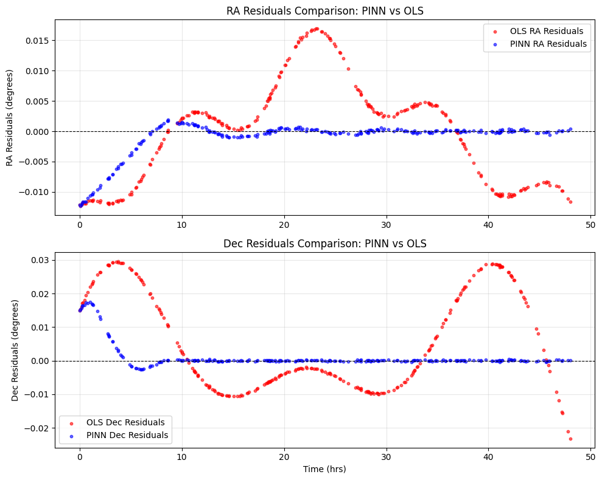
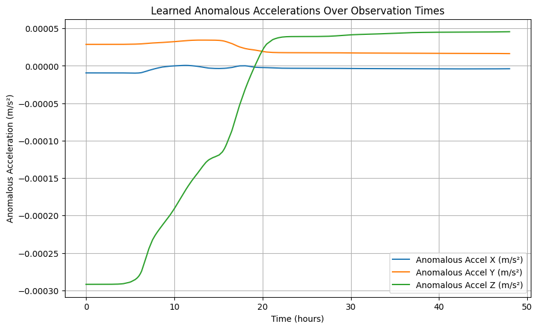
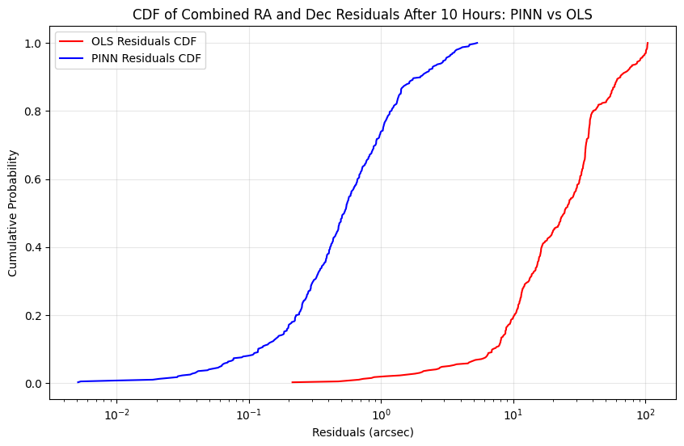

# Physics Informed Neural Networks (PINN) for satellite state estimation
Educational repo for learning about physics informed neural networks (PINNs) and their application  to 
estimate the orbital state of a satellite flying in geostationary orbit.

## Problem overview
The following repo is an attempt to implement this paper by [Varey et al.](https://ieeexplore.ieee.org/stamp/stamp.jsp?arnumber=10521414&casa_token=qRdAnbemqw0AAAAA:k8Se-ca4IhB_WpUVeIuZUWhEdUxOT2i97c8MHb1u9JqmxdZ-Wufy7RdmvR01AEhKuY9c6g&tag=1). Fitting an orbit of satellite 
requires an accurate model of the forces acting on it. High-quality, physics-based models designed for this purpose have existed for decades. 
However, most of these models only account for two-body keplerian motion + Earth gravity perturbations (e.g., J2-J6) + atmospheric drag, etc.
These models are quite accurate for estimating and propagating orbits of non-maneuvering satellites, but fail when there are anomalous, unaccounted
accelerations, such as the ones that would be observed if the satellite were equipped with low-thrust electric propulsion.

Physics informed neural networks (PINNs) are a useful tool for solving this kind of problem. PINNs combine the physics model with
deep neural networks, which are highly expressive and universal function approximators. This combination should allow the machine learning model
to avoid the need of learning the fundamental physics of astrodynamics, and allow it to focus on learning the anomalous acceleration dynamics/thrust
(in theory).

The exercise walk-through is done in the **`pinn_orbital_exploration.ipynb`** jupyter notebook, and the auxiliary functions used in the notebook can be found in **\utils**.

## Intro
The ground-truth satellite acceleration can be described as:

$$
a = -\frac{GM}{r^3}\mathbf{r} + \mathbf{a}_P + \mathbf{a}_T
$$

Where $G$ is the gravitational constant, $M$ is the mass of the primary body (i.e., Earth), $\mathbf{a}_P$ is the acceleration due
to natural perturbing forces (J2 in this simplified scenario. J2 perturbations are 1000 times stronger than the other pertubations due
to the oblateness of Earth, such as J3-J6), and $\mathbf{a}_T$ is the acceleration due to thrust.

As in the paper, the above equation is used to propagate the ground-truth orbital state and noise is added to observations to simulate real
data of a GEO satellite as seen from Earth, i.e., using angles-only data, that is, the right ascension (RA) and the declination over the course of two days, randomly sampled in time. 

The physics-only model is similar to the equation above, but excluding the thrust term.

## Thrust profile 

The goal is to learn an arbitrary thrust profile (applied in the intertial frame) as the one shown below.

  

This corresponds to a total $\Delta V \approx 10 \text{ m/s}$

## Technical approach
The equation of motion can be broken down into two functions: 

$$
a = f(t, X) + g(t, X)
$$

Where $f$ is the physical model incorporating astrodynamics and $g$ is the instantaneous thrust applied by the
propulsion system. 

The physics-only model is solved using OLS and then the residuals are calculated. The loss function used for training is the 
mean squared error (MSE) of the observation residuals. The PINN is solved by backpropagating the loss function
using an ODE solver (TorchDiffEq). The PINN uses a simple DNN with two hidden layers and one hundred neurons in each layer.
The Adam optimizer is used to tune the DNN parameters, decreasing the learning rate slowly using a fixed-step schedule
(a more sophisticated approach such as cosine annealing will be implemented in the future).

The initial state is guessed by using the first two noisy observations, and then improved during the OLS solution. 
The initial state guess is then subsequently finetuned every 100 iterations during the PINN training loop, as done in the paper.
Training the PINN for 20,000 iterations takes approximately 7 hrs (CPU only).

## Results
The plot below shows the residuals obtained for both the physics-only and PINN solutions:

  

This shows how after a noisy initial state estimation, the residuals are much lower for the PINN compared to the physics-only model.

The next step is to gauge whether the PINN learned an accurate thrust profile or not:

  

While the PINN does _not_ learn the expected sinusoidal thrust profile, at least it a) learns a thrust profile that minimises
the residuals b) is in the appropiate order of magnitude ($10\text{e-}05 \text{ m/s}^2$).

Ignoring the first 10 hours of the simulation, the CDF of the residuals also show a decrease of the observation residuals
of the PINN compared to the physics-only model:

  

However, the absolute position and velocity estimation errors obtained with the PINN after propagating the orbit for a further
48 hrs are much more modest compared to the ones stated in the paper. 

After 24 hrs, my PINN results in a position error of 94.04 km (vs 124.11 km with the physics-only model), and a
velocity error of 6.61 m/s (vs 9.85 m/s with the physics-only model).

After 48 hrs, my PINN results in a position error of 155.24 km (vs 235.32 km with the physics-only model), and a
velocity error of 11.07 m/s (vs 18.03 m/s with the physics-only model).