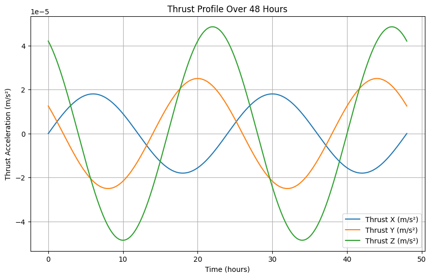

# Physics Informed Neural Networks (PINN) for satellite state estimation
Educational repo for learning about physics informed neural networks (PINNs) its application  to 
estimate the orbit of a satellite flying in geostationary orbit.

## Problem overview
The following repo is an attempt to implement this paper by [Varey et al.](https://ieeexplore.ieee.org/stamp/stamp.jsp?arnumber=10521414&casa_token=qRdAnbemqw0AAAAA:k8Se-ca4IhB_WpUVeIuZUWhEdUxOT2i97c8MHb1u9JqmxdZ-Wufy7RdmvR01AEhKuY9c6g&tag=1). Fitting an orbit of satellite 
requires an accurate model of the forces acting on it. High-quality, physics-based models designed for this purpose have existed for decades. 
However, most of these models only account for two-body keplerian motion + Earth gravity perturbations (e.g., J2-J6) + atmospheric drag, etc.
These models are quite accurate for estimating and propagating orbits of non-maneuvering satellites, but fail when there are anomalous, unaccounted
accelerations, such as the ones that would be observed if the satellite were equipped with low-thrust electric propulsion.

Physics informed neural networks (PINNs) are a useful tool for solving this kind of problem. PINNs combine the physics model with
deep neural networks, which are highly expressive and universal function approximators. This combination should allow the machine learning model
to avoid the need of learning the fundamental physics of astrodynamics, and allow it to focus on learning the anomalous acceleration dynamics/thrust
(in theory).

## Intro
The ground-truth satellite acceleration can be described as:

$$
\a = -\frac{GM}{r^3}\mathbf{r} + \mathbf{a}_P + \mathbf{a}_T
$$

Where $\G$ is the gravitational constant, $\M$ is the mass of the primary body (i.e., Earth), $\mathbf{a}_P$ is the acceleration due
to natural perturbing forces (J2 in this simplified scenario. J2 perturbations are 1000 times stronger than the other pertubations due
to the oblateness of Earth, such as J3-J6), and $\mathbf{a}_T$ is the acceleration due to thrust.

As in the paper, the above equation is used to propagate the ground-truth orbital state and noise is added to observations to simulate real
data of a GEO satellite as seen from Earth, i.e., using angles-only data, that is, the right ascension (RA) and the declination over the course of two days, randomly sampled in time. 

The physics-only model is similar to the equation above, but excluding the thrust term.

## Thrust profile 

The goal is to learn an arbitrary thrust profile (applied in the intertial frame) as the one shown below.

  

This corresponds to a total $\Delta v \approx 10 \text{ m/s}$

